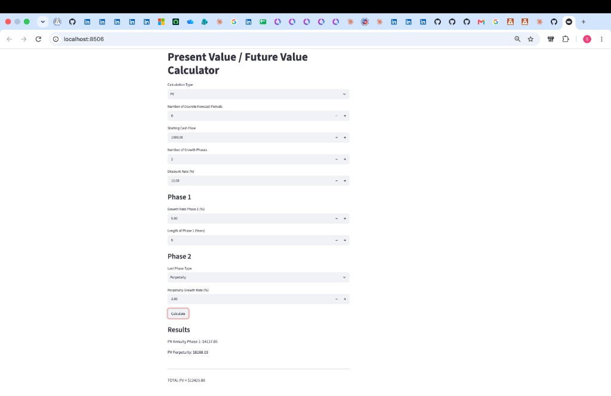
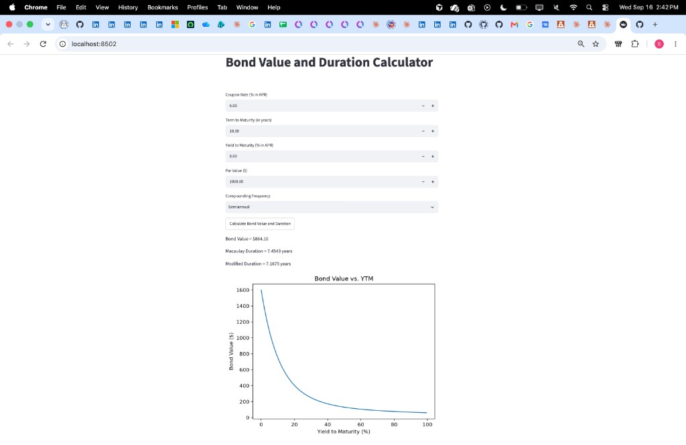
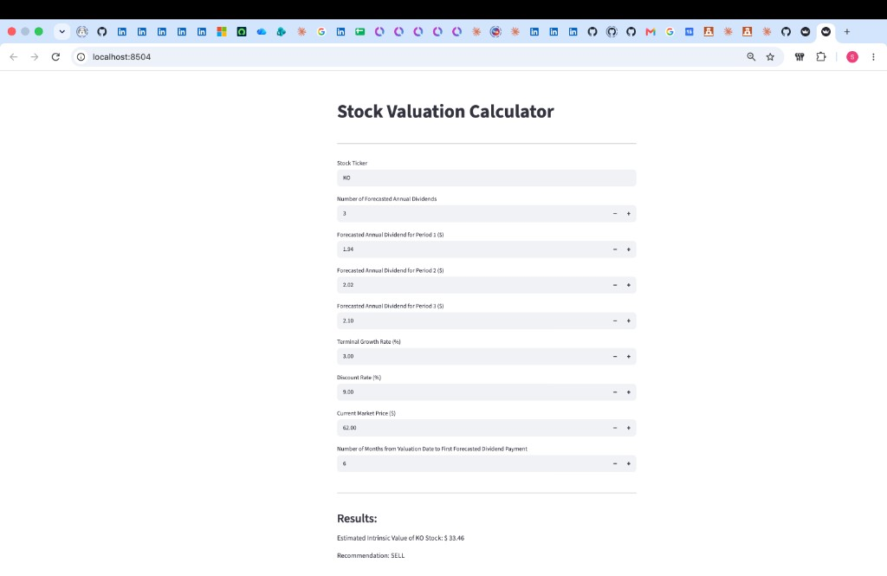
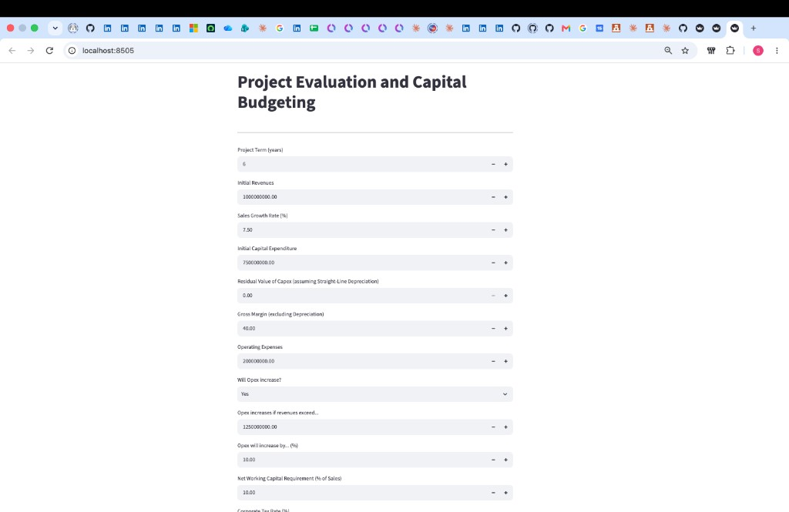
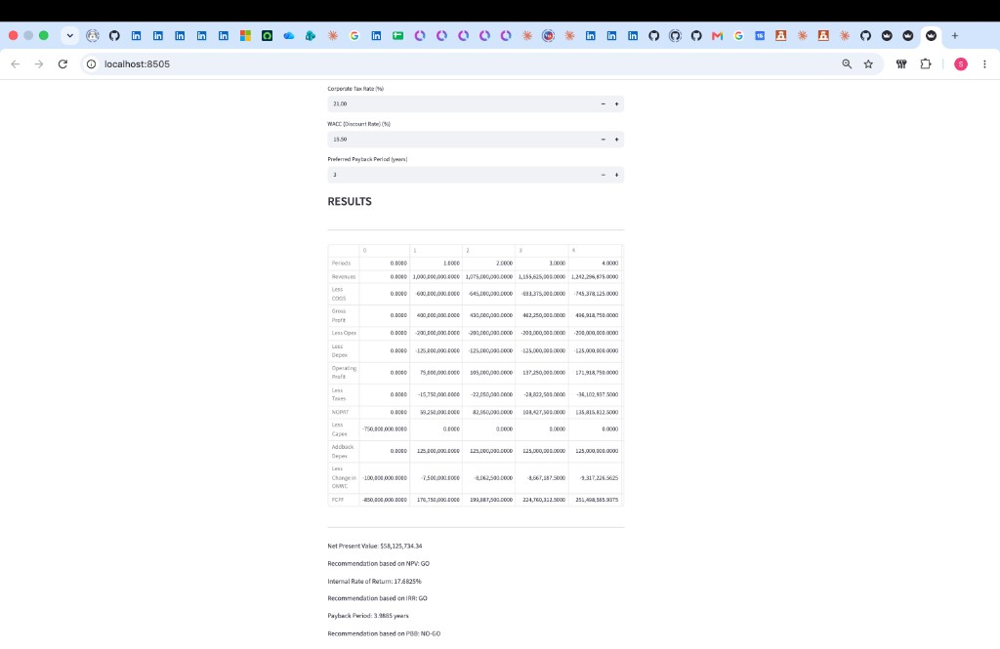

# Finance Valuation Dashboards

Four interactive valuation models built with Streamlit, covering the core
discounted-cash-flow methods used in investment research: the time value of
money, fixed-income pricing, equity valuation, and corporate project appraisal.

Each model is a self-contained app with live inputs, so assumptions can be
changed and their effect on value seen immediately. The valuation math is
written from first principles in plain Python rather than pulled from a
library, which keeps every formula visible and auditable.

## Setup

Requires Python 3.13.

```bash
python3.13 -m venv .venv
source .venv/bin/activate
pip install -r requirements.txt
```

## The models

### Time Value of Money

Present and future value across an arbitrary number of growth phases, with a
discrete cash-flow forecast and either an annuity or a growing perpetuity as
the terminal phase.

```bash
streamlit run time_value_of_money.py
```


*PV of a two-phase cash flow — 5 years of 5% growth then a 3% perpetuity, discounted at 12%.*

### Bond Valuation

Prices a coupon bond at any compounding frequency, reports Macaulay and
modified duration, and plots the price-yield curve to show convexity.

```bash
streamlit run bond_valuation.py
```


*Pricing a 6% semiannual coupon bond at an 8% yield — trades below par with ~7 year duration.*

### Equity DDM Valuation

Two-stage dividend discount model: an explicit dividend forecast plus a Gordon
growth terminal value, handling a partial first period, and returns a
BUY / HOLD / SELL recommendation against market price.

```bash
streamlit run equity_ddm_valuation.py
```


*DDM valuation of KO — 3-year dividend forecast with a 3% terminal growth rate discounted at 9%.*

### Capital Budgeting

Builds a full free-cash-flow-to-firm pro-forma from revenue growth, margins,
capex, working capital and tax, then evaluates it on NPV, IRR and payback
period with a GO / NO-GO recommendation on each.

```bash
streamlit run capital_budgeting.py
```



*Full FCFF pro-forma with NPV, IRR and payback — evaluating a $750M capex project at 15.5% WACC.*

## Notes on the modelling

- **Compounding is handled explicitly.** `bond_valuation.py` converts annual
  coupon and yield inputs to per-period figures rather than assuming annual
  payments, so semiannual and monthly bonds price correctly.
- **The dividend model supports a stub period.** Dividends rarely arrive
  exactly twelve months from the valuation date, so the first period can be
  fractional and is discounted accordingly.
- **Working capital is a cash flow, not an expense.** `capital_budgeting.py`
  models the change in net working capital each period and releases it in the
  final year, which is where simplified NPV models usually go wrong.
- **Terminal assumptions are constrained.** The perpetuity and Gordon growth
  formulas diverge when growth meets or exceeds the discount rate, so the
  inputs are bounded and the apps report the problem instead of returning a
  meaningless number.

## Built with

Python, Streamlit, pandas, matplotlib, NumPy Financial.
